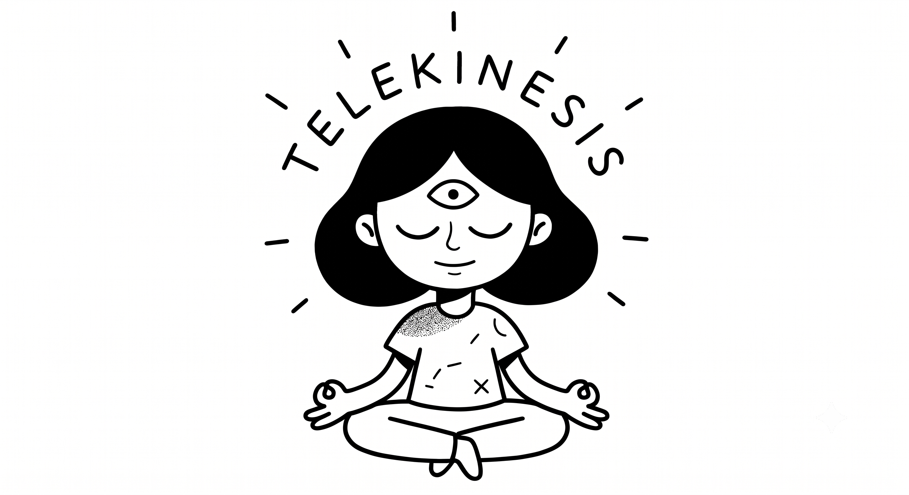
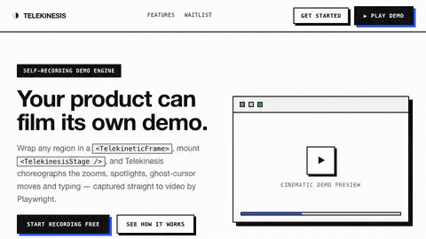
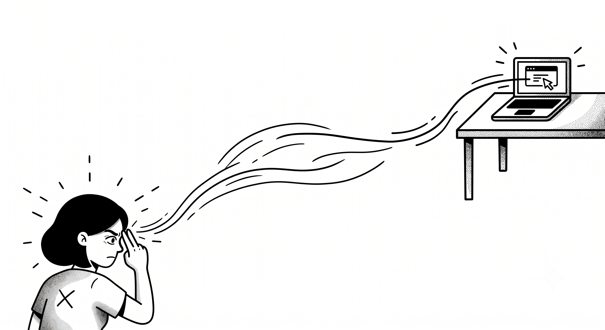
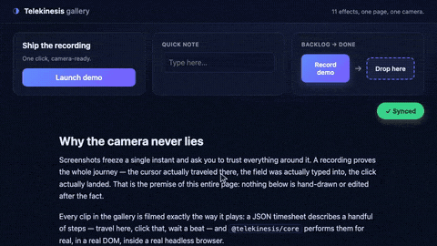
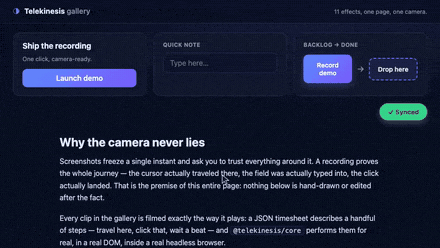
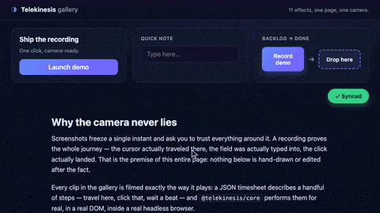

<div align="center">



**Your product films its own demo.**

Mark up your real UI once. An LLM (or you) writes a *timesheet*. Telekinesis
performs it live in the browser — ghost cursor, smooth zoom, spotlight,
real clicks and typing, sound — and hands you a video that's never out of date.

[](LICENSE)
[](#contributing)


</div>

<p align="center">

<br />
<em>This GIF was recorded by Telekinesis, about Telekinesis, in CI. So is every GIF below.</em>
</p>

---

## The problem

Product demos are hand-made, and hand-made things rot. Someone records a
walkthrough, ships it to the landing page or the docs, and six weeks later the
button has moved, the copy changed, and the video is quietly lying to
everyone who watches it.

Telekinesis treats the demo as **code**, not a recording you maintain by
hand. Describe the tour as data, run one command, and get a fresh,
pixel-accurate video straight from your live app — no screen-recording
software, no editing timeline, no re-shoots.

The trick (borrowed from [navigator.webdriver](https://developer.mozilla.org/en-US/docs/Web/API/Navigator/webdriver)
and pointed at cinematography instead of bot detection):

```
            Real visitor                         Playwright (or ?demo)
                 │                                        │
        <TelekineticFrame>                       <TelekineticFrame>
                 │                                        │
        ┌────────▼────────┐                      ┌────────▼─────────┐
        │  <>{children}</> │                      │  registered,     │
        │  zero footprint  │                      │  zoomable target │  ──▶ 🎬 video
        └─────────────────┘                      └──────────────────┘
```

Same component, two lives. Ship it and it compiles away to nothing for real
users. Point the recorder at it and it becomes a controllable, measurable
stage.

## What you get

- **Real interactions, not screen capture.** Playwright drives your actual
  app — real clicks, real typing, real drag-and-drop — so the video can never
  drift from what the product actually does.
- **Cinematic motion for free.** Smooth zoom, spotlight, a ghost cursor,
  shake, highlight — a small vocabulary of effects that read as intentional,
  human-directed camera work.
- **Sound that matches the action.** ffmpeg mixes clicks and keystrokes at
  their exact timestamps. No microphone, no audio hardware, works in CI.
- **AI-authored, schema-guarded.** Hand an LLM your UI's frame map through
  the MCP server and it drafts a timesheet — validated against a JSON Schema,
  so it can't hand you something unplayable.
- **A visual editor when you want one.** The Studio is a CapCut-style
  timeline for tuning a timesheet by eye instead of by hand.

## How it works

1. **Mark up** regions with `<TelekineticFrame id="...">` and mount
   `<TelekinesisStage>` once.
2. **Author a timesheet** — an ordered list of effects (`zoom-in`, `highlight`,
   `cursor-move`, `click`, `type-down`, …), by hand or via the MCP server.
3. **Record** — Playwright performs the visuals *and* the real clicks/typing,
   producing a silent video + a timestamped audio map.
4. **Mix** — the CLI lays each sound at its exact moment with ffmpeg (no audio
   hardware needed, CI-friendly).

## Quick start

```bash
pnpm add @telekinesis/core            # in your React/Next app
pnpm add -D @telekinesis/cli          # the recorder
pnpm exec playwright install chromium # one-time
```

Mark up your UI:

```tsx
import { TelekineticFrame, TelekinesisStage } from "@telekinesis/core";

export default function Pricing() {
  return (
    <>
      <TelekinesisStage />{/* mount once near the root */}

      <TelekineticFrame id="pricing" intent="pricing-table">
        <TelekineticFrame id="pro-tier" intent="primary-plan">
          <PlanCard name="Pro" />
        </TelekineticFrame>
        <TelekineticFrame id="buy" intent="primary-action">
          <button>Buy Pro</button>
        </TelekineticFrame>
      </TelekineticFrame>
    </>
  );
}
```

Write `flow.timesheet.json`:

```json
{
  "url": "http://localhost:3000?demo",
  "resolution": { "width": 1280, "height": 720 },
  "timeline": [
    { "action": "zoom-in", "frameId": "pricing", "scale": 1.12 },
    { "action": "highlight", "frameId": "pro-tier" },
    { "action": "cursor-move", "destFrameId": "buy" },
    { "action": "click", "frameId": "buy", "soundProfile": "macbook-trackpad" },
    { "action": "zoom-out" }
  ]
}
```

Preview, record, or edit it visually:

```bash
telekinesis preview flow.timesheet.json          # headed, no file
telekinesis record  flow.timesheet.json -o demo.mp4
telekinesis record  flow.timesheet.json --format both   # MP4 + GIF
telekinesis gif     flow.timesheet.json -o demo.gif     # a looping GIF
telekinesis studio  --target http://localhost:3000      # the visual editor (:57174)
```

## See it now (no install)

```bash
git clone https://github.com/CMolG/telekinesis.git && cd telekinesis
pnpm install
pnpm exec playwright install chromium   # one-time, for recording

pnpm docs          # the documentation — a Telekinetic app — at :4311
pnpm docs:motion   # record every docs section into a GIF (dogfooding)
pnpm studio        # the CapCut-style timesheet editor at :57174
pnpm playground    # the component sandbox at :5173
```

The docs and playground force demo mode, so the full cinematic layer runs live
in your browser — exactly what the recorder would capture. The **Studio**
(a rarely-used local port, 57174) embeds any Telekinetic app, shows which
components are telekinetic, and lets you tune timing and effects like a video
editor, then render a GIF or MP4.

<div align="center">

</div>

## Effects

An **effect** is one entry in a timesheet's `timeline` — a single camera move or
interaction, strongly typed by `@telekinesis/schema`. Every GIF and timesheet below
is real: recorded by `pnpm gallery:record`, not hand-picked, and kept honest by
[`e2e/tests/gallery-coverage.spec.ts`](e2e/tests/gallery-coverage.spec.ts).

### Interactions

#### `click`


The ghost cursor travels to the button, presses, and a ripple blooms
outward — a real Playwright click, not a drawn glyph. The ripple plays
out first; `soundProfile`'s sound lands with the real click itself, right after.

<details><summary>The timesheet that filmed this GIF</summary>

```json
{
  "version": "1.0",
  "meta": { "title": "click", "description": "Cursor travels, presses, ripples — and really clicks." },
  "url": "http://localhost:4173/gallery.html?demo",
  "resolution": { "width": 960, "height": 540 },
  "fps": 30,
  "timeline": [
    { "action": "wait", "duration": 400 },
    { "action": "cursor-move", "destFrameId": "gal-cta", "duration": 600 },
    { "action": "click", "frameId": "gal-cta", "soundProfile": "macbook-trackpad" },
    { "action": "wait", "duration": 1600 }
  ]
}
```

</details>

#### `type-down`


Types at human speed — `mistakes: true` gives each character a small,
independent chance of a typo that gets backspaced and corrected live, so
a run might land clean or catch a few. `typingSpeed` (ms/char) sets the
cadence, `soundProfile` the clatter.

<details><summary>The timesheet that filmed this GIF</summary>

```json
{
  "version": "1.0",
  "meta": {
    "title": "type-down",
    "description": "Human-speed typing with a stray keystroke, backspaced and corrected live."
  },
  "url": "http://localhost:4173/gallery.html?demo",
  "resolution": { "width": 960, "height": 540 },
  "fps": 30,
  "timeline": [
    { "action": "cursor-move", "destFrameId": "gal-input", "duration": 500 },
    { "action": "click", "frameId": "gal-input", "showRipple": false },
    {
      "action": "type-down",
      "frameId": "gal-input",
      "text": "motion is the message",
      "typingSpeed": 55,
      "mistakes": true,
      "soundProfile": "mechanical-keyboard",
      "delayAfter": 300
    },
    { "action": "wait", "duration": 600 }
  ]
}
```

</details>

#### `drag-and-drop`



Picks up the card and carries it into the drop zone, the cursor leading
the whole trip. `destFrameId` resolves the drop point at runtime — no
hardcoded pixels — and `easing` shapes the glide.

<details><summary>The timesheet that filmed this GIF</summary>

```json
{
  "version": "1.0",
  "meta": {
    "title": "drag-and-drop",
    "description": "Picks up the backlog card and carries it into Done, cursor leading the whole trip."
  },
  "url": "http://localhost:4173/gallery.html?demo",
  "resolution": { "width": 960, "height": 540 },
  "fps": 30,
  "timeline": [
    { "action": "wait", "duration": 500 },
    {
      "action": "drag-and-drop",
      "frameId": "gal-drag-src",
      "destFrameId": "gal-drag-dest",
      "duration": 900,
      "easing": "ease-in-out"
    },
    { "action": "highlight", "frameId": "gal-drag-dest", "duration": 500, "padding": 10 },
    { "action": "wait", "duration": 1200 }
  ]
}
```

</details>

#### `shake`


A sharp, decaying wobble on the target — anticipation before a click,
impossible to miss and gone in a blink. `intensity` (`low·medium·high`)
sets the amplitude; `duration` how long it takes to decay.

<details><summary>The timesheet that filmed this GIF</summary>

```json
{
  "version": "1.0",
  "meta": {
    "title": "shake",
    "description": "A sharp anticipation shake on the CTA — impossible to miss, gone in a blink."
  },
  "url": "http://localhost:4173/gallery.html?demo",
  "resolution": { "width": 960, "height": 540 },
  "fps": 30,
  "timeline": [
    { "action": "cursor-move", "destFrameId": "gal-cta", "duration": 550 },
    { "action": "shake", "frameId": "gal-cta", "intensity": "high", "duration": 650, "delayAfter": 250 },
    { "action": "wait", "duration": 1650 }
  ]
}
```

</details>

### Camera & navigation

#### `zoom-in`


The camera pushes into the frame and holds — a matrix scale+translate
anchored on `frameId`, eased by `easing`. `scale` sets how far it
pushes in before the hold.

<details><summary>The timesheet that filmed this GIF</summary>

```json
{
  "version": "1.0",
  "meta": {
    "title": "zoom-in",
    "description": "The camera pushes into the card and holds, framing it before anything else happens."
  },
  "url": "http://localhost:4173/gallery.html?demo",
  "resolution": { "width": 960, "height": 540 },
  "fps": 30,
  "timeline": [
    { "action": "wait", "duration": 400 },
    { "action": "zoom-in", "frameId": "gal-card", "scale": 1.35, "duration": 1000, "easing": "ease-out" },
    { "action": "wait", "duration": 1700 }
  ]
}
```

</details>

#### `zoom-out`



A clean pull back to scale 1 after a prior zoom-in — the same camera,
`duration` and `easing` set the pace of the release; it has no `frameId`
of its own, it just reverses whatever the last zoom-in framed.

<details><summary>The timesheet that filmed this GIF</summary>

```json
{
  "version": "1.0",
  "meta": {
    "title": "zoom-out",
    "description": "Zoomed in on the card, then a clean pull back out to the full page."
  },
  "url": "http://localhost:4173/gallery.html?demo",
  "resolution": { "width": 960, "height": 540 },
  "fps": 30,
  "timeline": [
    {
      "action": "zoom-in",
      "frameId": "gal-card",
      "scale": 1.35,
      "duration": 900,
      "easing": "ease-out",
      "delayAfter": 500
    },
    { "action": "zoom-out", "duration": 900, "easing": "ease-in-out" },
    { "action": "wait", "duration": 700 }
  ]
}
```

</details>

#### `scroll-down`


The window glides down the page and eases to a stop mid-content —
`distance` in pixels (or `"viewport"`) sets how far, `duration` and
`easing` set the pace.

<details><summary>The timesheet that filmed this GIF</summary>

```json
{
  "version": "1.0",
  "meta": {
    "title": "scroll-down",
    "description": "The window glides down into the article, easing to a stop mid-paragraph."
  },
  "url": "http://localhost:4173/gallery.html?demo",
  "resolution": { "width": 960, "height": 540 },
  "fps": 30,
  "timeline": [
    { "action": "wait", "duration": 600 },
    { "action": "scroll-down", "distance": 420, "duration": 900, "easing": "ease-in-out" },
    { "action": "wait", "duration": 1600 }
  ]
}
```

</details>

#### `scroll-up`


The mirror of scroll-down: sails back up by `distance` pixels over
`duration`, shaped by the same `easing` vocabulary — here starting
mid-article and returning to where the interactive sets begin.

<details><summary>The timesheet that filmed this GIF</summary>

```json
{
  "version": "1.0",
  "meta": {
    "title": "scroll-up",
    "description": "Starts mid-article and sails back up to where the interactive sets begin."
  },
  "url": "http://localhost:4173/gallery.html?demo",
  "resolution": { "width": 960, "height": 540 },
  "fps": 30,
  "timeline": [
    { "action": "scroll-down", "distance": 420, "duration": 0 },
    { "action": "wait", "duration": 600 },
    { "action": "scroll-up", "distance": 420, "duration": 900, "easing": "ease-in-out" },
    { "action": "wait", "duration": 1600 }
  ]
}
```

</details>

#### `cursor-move`



A long diagonal sweep corner to corner. `curve: "arc"` bows the path so
it reads as a hand, not a robot; `destFrameId` picks the destination and
`duration` the travel time.

<details><summary>The timesheet that filmed this GIF</summary>

```json
{
  "version": "1.0",
  "meta": {
    "title": "cursor-move",
    "description": "A long diagonal sweep across the whole stage, corner to corner."
  },
  "url": "http://localhost:4173/gallery.html?demo",
  "resolution": { "width": 960, "height": 540 },
  "fps": 30,
  "timeline": [
    { "action": "cursor-move", "destFrameId": "gal-card", "duration": 500 },
    { "action": "wait", "duration": 300 },
    { "action": "cursor-move", "destFrameId": "gal-done", "duration": 1400, "curve": "arc" },
    { "action": "wait", "duration": 900 }
  ]
}
```

</details>

#### `highlight`


The spotlight dims everything but a rounded cutout around `frameId`,
then slides from the whole card to just the button inside it. `padding`
controls how tightly the cutout hugs the frame.

<details><summary>The timesheet that filmed this GIF</summary>

```json
{
  "version": "1.0",
  "meta": {
    "title": "highlight",
    "description": "The spotlight slides from the whole card to just the button inside it."
  },
  "url": "http://localhost:4173/gallery.html?demo",
  "resolution": { "width": 960, "height": 540 },
  "fps": 30,
  "timeline": [
    { "action": "wait", "duration": 500 },
    { "action": "highlight", "frameId": "gal-card", "duration": 700, "delayAfter": 200 },
    { "action": "highlight", "frameId": "gal-cta", "duration": 900, "padding": 10 },
    { "action": "wait", "duration": 800 }
  ]
}
```

</details>

#### `wait`


A pure pause — `duration` in milliseconds, nothing else. Here it's
bracketed by two `highlight` calls so the held beat reads as rhythm in
the GIF, not as dead air.

<details><summary>The timesheet that filmed this GIF</summary>

```json
{
  "version": "1.0",
  "meta": {
    "title": "wait",
    "description": "A held spotlight, a deliberate pause, then the payoff slides into view."
  },
  "url": "http://localhost:4173/gallery.html?demo",
  "resolution": { "width": 960, "height": 540 },
  "fps": 30,
  "timeline": [
    { "action": "highlight", "frameId": "gal-cta", "duration": 400, "delayAfter": 200 },
    { "action": "wait", "duration": 1500 },
    { "action": "highlight", "frameId": "gal-done", "duration": 600, "delayAfter": 400 }
  ]
}
```

</details>

Full field reference for every effect (defaults, easing, sound profiles):
[`docs/effects.md`](docs/effects.md). For the shape of a whole timesheet:
[`docs/timesheet.md`](docs/timesheet.md).

## AI: the MCP server

```json
{ "mcpServers": { "telekinesis": { "command": "telekinesis-mcp" } } }
```

- `extract_ui_context({ url })` — what frames are on screen
- `generate_timesheet({ url, goal })` — a **schema-validated** draft to refine

The model never hallucinates an unplayable sheet: the
[JSON Schema](packages/schema/README.md) is the guardrail. See
[`packages/mcp`](packages/mcp/README.md).

## Packages

| Package | Role |
| --- | --- |
| [`@telekinesis/schema`](packages/schema) | Zod effects + timesheet + sound catalog + JSON Schema + `layoutTimesheet` — the shared contract |
| [`@telekinesis/core`](packages/core) | `<TelekineticFrame>`, `<TelekinesisStage>`, registry, cursor, effects engine, `window.__telekinesis`, the Studio `postMessage` bridge |
| [`@telekinesis/engine`](packages/engine) | Playwright recorder → silent video + `audio-map.json` |
| [`@telekinesis/render`](packages/render) | ffmpeg: mix timed audio into an MP4, and export high-quality GIFs (palette or gifski) |
| [`@telekinesis/cli`](packages/cli) | `record` / `gif` / `preview` / `studio` / `init` / `sounds` |
| [`@telekinesis/mcp`](packages/mcp) | MCP server: `extract_ui_context`, `generate_timesheet` |
| [`apps/docs`](apps/docs) | the Nextra documentation — itself a Telekinetic app that records its own tutorials |
| [`apps/studio`](apps/studio) | the Studio: a CapCut-style visual timesheet editor |
| [`playground`](playground) | a Vite sandbox that previews the cinematics live |

## Develop

```bash
pnpm install         # everything (set PLAYWRIGHT_SKIP_BROWSER_DOWNLOAD=1 to skip browsers)
pnpm typecheck
pnpm test            # schema unit tests
pnpm build           # build all publishable packages
pnpm playground      # live demo
```

Architecture deep-dive: [`docs/architecture.md`](docs/architecture.md).

## Quality

The suite runs in three layers: Vitest unit tests (schema, easing, spring, cursor
math), Playwright e2e in a real browser (runtime install, zero-footprint mode,
every effect's observable invariants), and the full record → mix → gif pipeline
through real ffmpeg — `pnpm e2e` runs the browser and pipeline layers, `pnpm test`
the unit layer.

Every GIF above is also a human visual-regression fixture: it's produced by the
same engine your app records with, so if a PR changes how the engine feels, it
changes this diff.

## Contributing

Telekinesis is built in the open and built for the community using it — issues,
ideas, and PRs are genuinely welcome, not just tolerated. The contract lives in
`@telekinesis/schema`: extend it there first, and every other package follows.

Good first stops:

- Found a bug or a rough edge? [Open an issue](https://github.com/CMolG/telekinesis/issues).
- Building something with it? Show us — a demo video from your own app is the
  best kind of bug report.
- Want to add an effect, a sound profile, or a framework target? Start a
  discussion before the PR so the schema stays coherent.

If Telekinesis saves you from recording another demo by hand, a star helps
other people find it.

## License

[MIT](LICENSE) © Telekinesis contributors
